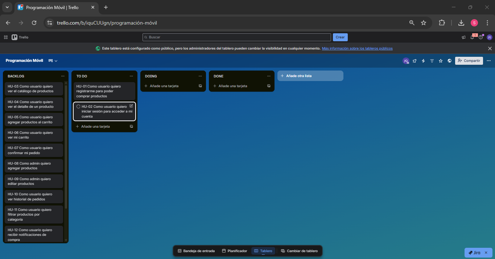

# Actividad 2 – Planificación Ágil  
Proyecto: Accesorios D&M

---

# 1. Metodología Elegida

## Metodología: Scrum

### Justificación

1. **Trabajo por entregas incrementales:** Nos permite dividir el proyecto en pequeños incrementos funcionales (sprints) y mostrar avances reales cada semana.
2. **Mejor organización del equipo:** Define roles, objetivos y entregables claros, evitando improvisación.
3. **Enfoque en MVP:** Scrum facilita priorizar lo más importante (Must) y evitar sobrecargar el alcance.

---

# 2. Backlog del Producto

Estimación en puntos: 1 – 2 – 3 – 5 – 8

| ID | Historia de Usuario | Prioridad | Estimación | Criterios de Aceptación (GWT) |
|----|----------------------|------------|------------|--------------------------------|
| HU-01 | Como usuario quiero registrarme para poder comprar productos | Must | 5 | **Given** que estoy en registro, **When** ingreso datos válidos, **Then** la cuenta se crea correctamente |
| HU-02 | Como usuario quiero iniciar sesión para acceder a mi cuenta | Must | 3 | Given credenciales válidas, When inicio sesión, Then accedo al sistema |
| HU-03 | Como usuario quiero ver el catálogo de productos | Must | 5 | Given que estoy autenticado, When ingreso al catálogo, Then veo la lista de productos |
| HU-04 | Como usuario quiero ver el detalle de un producto | Must | 3 | Given que selecciono un producto, When entro al detalle, Then veo descripción, precio e imagen |
| HU-05 | Como usuario quiero agregar productos al carrito | Must | 5 | Given que estoy en un producto, When presiono agregar, Then el producto se añade al carrito |
| HU-06 | Como usuario quiero ver mi carrito | Must | 3 | Given que tengo productos agregados, When entro al carrito, Then veo lista y total |
| HU-07 | Como usuario quiero confirmar mi pedido | Must | 5 | Given que tengo productos en carrito, When confirmo, Then se genera un pedido |
| HU-08 | Como admin quiero agregar productos | Must | 5 | Given que soy admin, When registro producto, Then aparece en catálogo |
| HU-09 | Como admin quiero editar productos | Should | 3 | Given producto existente, When lo modifico, Then se actualiza en catálogo |
| HU-10 | Como usuario quiero ver historial de pedidos | Should | 3 | Given que he comprado antes, When entro a historial, Then veo pedidos anteriores |
| HU-11 | Como usuario quiero filtrar productos por categoría | Could | 2 | Given que estoy en catálogo, When selecciono categoría, Then solo veo productos relacionados |
| HU-12 | Como usuario quiero recibir notificaciones de compra | Could | 2 | Given que realizo un pedido, When se confirma, Then recibo notificación |

---

# 3. Tablero Ágil

Columnas mínimas:

- Backlog
- To Do
- Doing
- Done

(El tablero lo cree en Trello).

Link: https://trello.com/b/iquCUUgn/programaci%C3%B3n-m%C3%B3vil
---

# 4. Plan del Sprint 1

## Duración
1 semana

## Objetivo del Sprint 1
Tener funcional el sistema básico de autenticación y visualización de productos.

## Historias Seleccionadas

- HU-01 Registro
- HU-02 Login
- HU-03 Ver catálogo
- HU-04 Ver detalle de producto
- HU-08 Agregar producto (admin)

---

## Tareas por Historia

### HU-01 Registro
- Diseñar modelo de usuario en base de datos
- Crear endpoint de registro
- Validaciones básicas
- Crear pantalla móvil de registro
- Conectar app con API

### HU-02 Login
- Endpoint de autenticación
- Generación de token (JWT simulado si aplica)
- Pantalla login móvil
- Manejo de sesión

### HU-03 Catálogo
- Modelo de producto
- Endpoint GET productos
- Pantalla lista de productos
- Pruebas de carga de datos

### HU-04 Detalle producto
- Endpoint GET producto por ID
- Pantalla detalle
- Navegación desde catálogo

### HU-08 Agregar producto
- Endpoint POST producto
- Validaciones
- Pruebas desde Postman

---

# 5. Definición de Terminado (DoD)

Una historia se considera terminada cuando:

1. El código compila sin errores.
2. La funcionalidad funciona correctamente.
3. Cumple los criterios de aceptación (GWT).
4. Está integrada con el backend.
5. Fue probada manualmente.
6. Está subida al repositorio.
7. Tiene evidencia (capturas o video corto).

---

# Conclusión

Con esta planificación ágil usando Scrum, el proyecto Accesorios D&M queda organizado en un backlog priorizado y un Sprint 1 enfocado en la base funcional del sistema. Esto permite avanzar de forma controlada, medible y alineada con el MVP definido en la semana anterior.